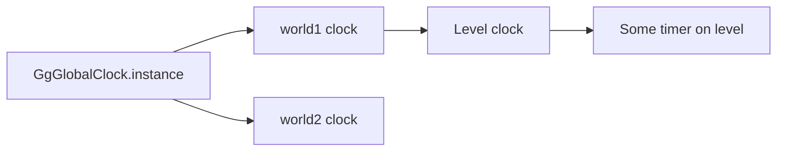
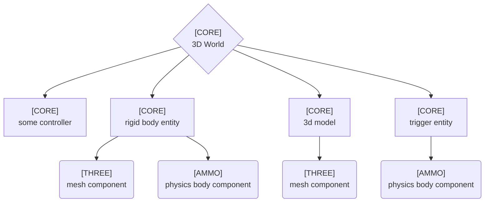
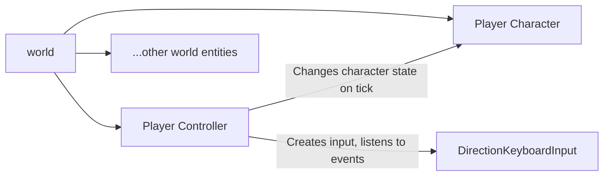

<h1 align="center">🚀 GG-Web-Engine</h1>
<h3 align="center">A modular, open-source game engine for the web. Build stunning 2D/3D games and simulations with ease.</h3>
<p align="center">
  
</p>

<p align="center">
  <a href="#-about">About</a> •
  <a href="#-key-features">Key Features</a> •
  <a href="#-vision">Vision</a> •
  <a href="#-current-status">Current Status</a> •
  <a href="#-integrations">Integrations</a> •
  <a href="#-quickstart">Quickstart</a> •
  <a href="#%EF%B8%8F-examples">Examples</a> •
  <a href="#-documentation">Documentation</a> •
  <a href="#-architecture">Architecture</a> •
  <a href="#-faq">FAQ</a> •
  <a href="#-support">Support</a> •
  <a href="#-license">License</a>
</p>

---

## 🎨 About
GG-Web-Engine is an open-source framework designed to accelerate the development of web-based 2D/3D applications,
including games and simulations. Instead of reinventing the wheel, it integrates seamlessly with powerful libraries
like Three.js for rendering and Ammo.js for physics, giving developers complete control over these tools.

Built with flexibility in mind, the engine is designed to work with various tech stacks and allows swapping libraries or
creating custom solutions with minimal effort.

## 🌟 Key Features
- Multi-library Integration: Supports rendering and physics libraries like Three.js, Ammo.js, Pixi.js, Matter.js, and more.
- 2D & 3D Support: Build both 2D and 3D worlds effortlessly.
- Ready-to-use Tools: Includes core functionalities like rendering loops, physics ticks, input handling, and more.
- Serialization & Export: Built-in Blender exporter for 3D geometry and physics properties.
- Entity System: Modular design with reusable entities for rendering, physics, cameras, vehicles, and more.
- Extensible Architecture: Easily integrate or replace components with custom implementations.
- Modern Tech Stack: Written in TypeScript with RxJS for reactive programming.

## 🔭 Vision
- Provide seamless integrations for existing rendering, physics, and sound libraries.
- Deliver a robust foundation for both 2D and 3D game worlds.
- Empower developers with tools like developer console, cameras, and debug utilities.
- Maintain modularity to ensure maximum flexibility for developers.
- Stay library-agnostic, enabling developers to switch or customize libraries with ease.

## 🚧 Current Status
### **<span style="color:red">Experimental Release**</span>

This engine began as part of a project to recreate an old NFS game
[The Need For Speed Web](https://tnfsw.guraklgames.com/). Its modular architecture was inspired by the challenges of
switching from Cannon.js to Ammo.js and, eventually, to custom reverse-engineered physics engine with minimal changes.

While the current focus is on racing game features and 3D worlds, future updates will expand the engine's versatility. Contributions, feature requests, and bug reports are warmly welcomed!

## ✨ Features at a Glance
- Physics/Rendering Synchronization: Automates position/rotation updates.
- Customizable Controllers: Add functionality with reusable tick-based controllers.
- Entities: Predefined entities like rigid bodies, triggers, raycast vehicles, and more.
- Developer Console: Built-in UI console for debugging and tweaking settings.
- Map Graph Loading: Load map areas dynamically based on proximity (3D worlds).
- Free-Fly Camera: Explore 3D worlds effortlessly.

## 🔌 Integrations
> Note: Current integrations are in early stages and will become more flexible in future releases.

- [**@gg-web-engine/three**](https://github.com/AndyGura/gg-web-engine/tree/main/packages/three/README.md) - 3D rendering ([Three.js](https://github.com/mrdoob/three.js))
- [**@gg-web-engine/ammo**](https://github.com/AndyGura/gg-web-engine/tree/main/packages/ammo/README.md) - 3D physics ([Ammo.js](https://github.com/kripken/ammo.js))
- [**@gg-web-engine/rapier3d**](https://github.com/AndyGura/gg-web-engine/tree/main/packages/rapier3d/README.md) - 3D physics ([Rapier.js](https://github.com/dimforge/rapier.js))
- [**@gg-web-engine/pixi**](https://github.com/AndyGura/gg-web-engine/tree/main/packages/pixi/README.md) - 2D rendering ([Pixi.js](https://github.com/pixijs/pixijs))
- [**@gg-web-engine/matter**](https://github.com/AndyGura/gg-web-engine/tree/main/packages/matter/README.md) - 2D physics ([Matter.js](https://github.com/liabru/matter-js))
- [**@gg-web-engine/rapier2d**](https://github.com/AndyGura/gg-web-engine/tree/main/packages/rapier2d/README.md) - 2D physics ([Rapier.js](https://github.com/dimforge/rapier.js))

## ⚡ Quickstart
### Installation
1) Install the core package:
```bash
npm install --save @gg-web-engine/core
```
2) Install integration modules. For example, to use Three.js and Ammo.js:
```bash
npm install --save @gg-web-engine/three @gg-web-engine/ammo
```

### Usage:
1) add somewhere in dom tree: ```<canvas id="gg"></canvas>```
1) remove default margin from page via CSS: ```body { margin: 0; }```
1) write bootstrap script, example:
```typescript
import { Gg3dWorld, Pnt3, Qtrn } from '@gg-web-engine/core';
import { ThreeSceneComponent } from '@gg-web-engine/three';
import { AmmoWorldComponent } from '@gg-web-engine/ammo';

// create world
const world = new Gg3dWorld(new ThreeSceneComponent(), new AmmoWorldComponent());
await world.init();

// create viewport and renderer
const renderer = world.addRenderer(
  world.visualScene.factory.createPerspectiveCamera(),
  document.getElementById('gg')! as HTMLCanvasElement
);
renderer.position = { x: 12, y: 12, z: 12 };
renderer.rotation = Qtrn.lookAt(renderer.camera.position, Pnt3.O);

// create floor (static rigid body)
world.addPrimitiveRigidBody({
  shape: { shape: 'BOX', dimensions: { x: 7, y: 7, z: 1 } },
  body: { dynamic: false },
});

// spawn cubes with mass 1kg twice a second
const spawnTimer = world.createClock(true);
spawnTimer.tickRateLimit = 2;
spawnTimer.tick$.subscribe(() => {
  // generate cube
  let item = world.addPrimitiveRigidBody({
    shape: { shape: 'BOX', dimensions: { x: 1, y: 1, z: 1 } },
    body: { mass: 1 },
  });
  // set position to cube
  item.position = { x: Math.random() * 5 - 2.5, y: Math.random() * 5 - 2.5, z: 10 };
  // delete cube from world after 30 seconds
  setTimeout(() => { world.removeEntity(item, true); }, 30000);
});

// start simulation
world.start();
```
And run it:
<p align="center">
  
</p>

## 🛠️ Examples
### [Interactive Demos](https://gg-web-demos.guraklgames.com/)
### Framework Usage
- #### Angular: [Example Project](https://stackblitz.com/github/AndyGura/gg-web-engine/tree/main/examples/framework-angular-three-ammo?file=src%2Fmain.ts)
- #### React: [Example Project](https://stackblitz.com/github/AndyGura/gg-web-engine/tree/main/examples/framework-react-three-rapier3d?file=src%2FApp.tsx)

## 📚 Documentation
Explore the complete technical documentation: [GitHub Pages](https://andygura.github.io/gg-web-engine/).

## 🌌 Architecture
The most important thing in the engine is [GgWorld](https://andygura.github.io/gg-web-engine/modules/core/base/gg-world.ts/).
It encapsulates everything you need in your game runtime: ticker clock, visual scene, physics simulation world etc.
One browser tab can run one or many GG worlds. In order to add something to the world, caller code needs to add
[Entities](https://andygura.github.io/gg-web-engine/modules/core/base/entities/i-entity.ts/). Entity is anything which
works in the world: tick-based controller, rigid body, renderer etc. World and entity are self-sufficient in gg core
package, so they do not depend on selected integration library. Entity can use from 0 to many
[World Components](https://andygura.github.io/gg-web-engine/modules/core/base/components/i-world-component.ts/#i-world-component-overview) -
those are fully dependent on integration library, so libraries in general case only implement components.

Full technical documentation available at [GitHub Pages](https://andygura.github.io/gg-web-engine/)

### Clock
Clock is an entity, responsible for tracking time and firing ticks. It measures time and on each tick emits two numbers:
`elapsedTime` and `delta`, where `delta` always equals to difference between current elapsed time, and elapsed time,
fired on the previous tick. All clock instances have hierarchy: pausing clock will automatically pause all of its child
clocks, which is nice to use for in-game timers: all timers will be paused when world clock is paused. There are two
built-in implementations of clock:
#### [GgGlobalClock](https://andygura.github.io/gg-web-engine/modules/core/base/clock/global-clock.ts/)
Singleton, starts emitting ticks as soon as accessed. For scheduling ticks, it uses `requestAnimationFrame` API.
The elapsed time for each tick is a timestamp, e.g. total amount of milliseconds, passed from
01.01.1970 00:00:00.000 UTC. The instance of this clock is always the root clock in clocks hierarchy
#### [PausableClock](https://andygura.github.io/gg-web-engine/modules/core/base/clock/pausable-clock.ts/)
The class for all remaining clocks: it measures time elapsed when was started. Has the ability to be paused/resumed,
and elapsed time will not be affected by pause: it will proceed from the same state it was paused. Every world has its
own instance of PausableClock, where parent clock is **GgGlobalClock**
#### Example of clocks hierarchy


### [World](https://andygura.github.io/gg-web-engine/modules/core/base/gg-world.ts/)
World is a container of all entities of your game, manages the entire flow. Though it is possible to have multiple
worlds in one page, in most cases you only need one. World consists of:
- clock
- visual scene, containing everything related to rendering. This is a [component](https://andygura.github.io/gg-web-engine/modules/core/base/components/rendering/i-visual-scene.component.ts/),
  which has to be implemented by integration library
- physics world, containing everything related to physics simulation. This is a [component](https://andygura.github.io/gg-web-engine/modules/core/base/components/physics/i-physics-world.component.ts/#iphysicsworldcomponent-interface),
  which has to be implemented by integration library
- list of all spawned world entities, sorted by tick order, and API for spawning/removing them
- logic to propagate clock ticks to every spawned active entity
- keyboard input

There are two built-in variants of world implementation: **[Gg2dWorld](https://andygura.github.io/gg-web-engine/modules/core/2d/gg-2d-world.ts/)** and **[Gg3dWorld](https://andygura.github.io/gg-web-engine/modules/core/3d/gg-3d-world.ts/)**

Example of hierarchy of entities of simple scene, which uses three.js + ammo.js:


### [Component](https://andygura.github.io/gg-web-engine/modules/core/base/components/i-component.ts/#icomponent-interface)
Anything, which has to be implemented in integration library:
- **[IVisualScene2dComponent](https://andygura.github.io/gg-web-engine/modules/core/2d/components/rendering/i-visual-scene-2d.component.ts/#ivisualscene2dcomponent-interface) / [IVisualScene3dComponent](https://andygura.github.io/gg-web-engine/modules/core/3d/components/rendering/i-visual-scene-3d.component.ts/#ivisualscene3dcomponent-interface)** a wrapper around visual scene or display object container
- **[IDisplayObject2dComponent](https://andygura.github.io/gg-web-engine/modules/core/2d/components/rendering/i-display-object-2d.component.ts/#idisplayobject2dcomponent-interface) / [IDisplayObject3dComponent](https://andygura.github.io/gg-web-engine/modules/core/3d/components/rendering/i-display-object-3d.component.ts/#idisplayobject3dcomponent-interface)** a wrapper around mesh or sprite
- **[IRenderer2dComponent](https://andygura.github.io/gg-web-engine/modules/core/2d/components/rendering/i-renderer-2d.component.ts/#irenderer2dcomponent-class) / [IRenderer3dComponent](https://andygura.github.io/gg-web-engine/modules/core/3d/components/rendering/i-renderer-3d.component.ts/#irenderer3dcomponent-class)** a wrapper around renderer
- **[IPhysicsWorld2dComponent](https://andygura.github.io/gg-web-engine/modules/core/2d/components/physics/i-physics-world-2d.component.ts/#iphysicsworld2dcomponent-interface) / [IPhysicsWorld3dComponent](https://andygura.github.io/gg-web-engine/modules/core/3d/components/physics/i-physics-world-3d.component.ts/#iphysicsworld3dcomponent-interface)** a wrapper around physics world
- **[IRigidBody2dComponent](https://andygura.github.io/gg-web-engine/modules/core/2d/components/physics/i-rigid-body-2d.component.ts/#irigidbody2dcomponent-interface) / [IRigidBody3dComponent](https://andygura.github.io/gg-web-engine/modules/core/3d/components/physics/i-rigid-body-3d.component.ts/#irigidbody3dcomponent-interface)** a wrapper around rigid body
- **[ITrigger2dComponent](https://andygura.github.io/gg-web-engine/modules/core/2d/components/physics/i-trigger-2d.component.ts/#itrigger2dcomponent-interface) / [ITrigger3dComponent](https://andygura.github.io/gg-web-engine/modules/core/3d/components/physics/i-trigger-3d.component.ts/#itrigger3dcomponent-interface)** a wrapper around physics object, which only detects intersections with other physics objects
- **[ICameraComponent](https://andygura.github.io/gg-web-engine/modules/core/3d/components/rendering/i-camera.component.ts/#icameracomponent-interface)** a wrapper around camera (3D world)
- **[IRaycastVehicleComponent](https://andygura.github.io/gg-web-engine/modules/core/3d/components/physics/i-raycast-vehicle.component.ts/#iraycastvehiclecomponent-interface)** raycast vehicle (3D world)

For instance, `@gg-web-engine/three` implements 4 components: `IVisualScene3d`, `IDisplayObject3d`, `IRenderer3d`, `ICamera`.

### [Entity](https://andygura.github.io/gg-web-engine/modules/core/base/entities/i-entity.ts/)
Basically, everything that listens ticks and can be added/removed from world. Built-in entities:
- **[Entity2d](https://andygura.github.io/gg-web-engine/modules/core/2d/entities/entity-2d.ts/#entity2d-class)** / **[Entity3d](https://andygura.github.io/gg-web-engine/modules/core/3d/entities/entity-3d.ts/#entity3d-class)** encapsulates display object (sprite or mesh respectively) and rigid body.
  Synchronizes position/rotation each tick
- **[Trigger2dEntity](https://andygura.github.io/gg-web-engine/modules/core/2d/entities/trigger-2d.entity.ts/#trigger2dentity-class)** / **[Trigger3dEntity](https://andygura.github.io/gg-web-engine/modules/core/3d/entities/trigger-3d.entity.ts/#trigger3dentity-class)** has only physics body, but instead of participating in collisions, emits
  events when some another positionable entity entered/left its area
- **[InlineTickController](https://andygura.github.io/gg-web-engine/modules/core/base/entities/controllers/inline-controller.ts/#createinlinetickcontroller)** simple controller, which can be created and added to world using one line of code
- **[Renderer](https://andygura.github.io/gg-web-engine/modules/core/base/entities/i-renderer.entity.ts/#irendererentity-class)** controller, which renders the scene and controls canvas size (if canvas provided). Makes canvas appearing fullscreen by default
- **[AnimationMixer](https://andygura.github.io/gg-web-engine/modules/core/base/entities/controllers/animation-mixer.ts/#animationmixer-class)** controller, which mixes animations: use-case is if you have some animation function, and you need a
  smooth transition to another animation function
- **[Entity2dPositioningAnimator](https://andygura.github.io/gg-web-engine/modules/core/2d/entities/controllers/entity-2d-positioning.animator.ts/#entity2dpositioninganimator-class)** / **[Entity3dPositioningAnimator](https://andygura.github.io/gg-web-engine/modules/core/3d/entities/controllers/animators/entity-3d-positioning.animator.ts/#entity3dpositioninganimator-class)** controllers extending **AnimationMixer**, which apply
  position/rotation to positionable entity
- **[Camera3dAnimator](https://andygura.github.io/gg-web-engine/modules/core/3d/entities/controllers/animators/camera-3d.animator.ts/#camera3danimator-class)** dedicated **AnimationMixer** for perspective camera: translates camera, target, up, fov etc.
- **[FreeCameraController](https://andygura.github.io/gg-web-engine/modules/core/3d/entities/controllers/input/free-camera.controller.ts/#freecameracontroller-class)** a controller, allows to control camera with WASD + mouse
- **[CarKeyboardHandlingController](https://andygura.github.io/gg-web-engine/modules/core/3d/entities/controllers/input/car-keyboard-handling.controller.ts/#carkeyboardhandlingcontroller-class)** a controller allowing to control car with keyboard
- **[MapGraph3dEntity](https://andygura.github.io/gg-web-engine/modules/core/3d/entities/map-graph-3d.entity.ts/#mapgraph3dentity-class)** an entity, which loads parts of big map and disposes loaded map chunks, which are far away
- **[RaycastVehicle3dEntity](https://andygura.github.io/gg-web-engine/modules/core/3d/entities/raycast-vehicle-3d.entity.ts/#raycastvehicle3dentity-class)** a general entity with raycast vehicle. Encapsulates positioning binding for chassis and wheels meshes, provides simplified interface for applying engine or brake forces
- **[GgCarEntity](https://andygura.github.io/gg-web-engine/modules/core/3d/entities/gg-car/gg-car.entity.ts/#ggCarentity-class)** a more sophisticated 4-wheel car which simulates engine with torque table, gear box etc.
- **[SurfaceFollowingEntity](https://andygura.github.io/gg-web-engine/modules/core/3d/entities/surface-following.entity.ts/#surfacefollowingentity-class)** An entity which simulates smooth surface collider, declared parametrically

### [Input](https://andygura.github.io/gg-web-engine/modules/core/base/inputs/input.ts/)
Input is a class, responsible for handling external actions, such as mouse move, key presses, gamepad interactions etc.
When implementing multiplayer, it probably will be the best place to handle incoming data for reflecting it on the world
state. Input does not depend on ticks and is not a part of the world, it should be created and used by some controller
entity, added to the world. All inputs extend abstract class Input<TStartParams, TStartParams>. Engine provides those
inputs out-of-box:
#### [KeyboardInput](https://andygura.github.io/gg-web-engine/modules/core/base/inputs/keyboard.input.ts/)
This input handles key presses, allows to setup key bindings: provides Observable<boolean>, which emits true on key down
and false on key up. When binding many keys to the same functionality, will emit true when any of bound keys pressed,
and false only when all bound keys released. Every world has its own instance of keyboard controller
#### [MouseInput](https://andygura.github.io/gg-web-engine/modules/core/base/inputs/mouse.input.ts/)
This input handles mouse movements and provides an Observable, which emits how much mouse position changed after last
event. Supports pointer lock functionality
#### [DirectionKeyboardInput](https://andygura.github.io/gg-web-engine/modules/core/base/inputs/direction.keyboard-input.ts/)
A shortcut for implementing direction key bindings: WASD, arrows, or both at once. Provides observable with direction
#### Example of input usage


### Factory
There is simple factory, allowing to easily create rigid bodies. See
[2D](https://andygura.github.io/gg-web-engine/modules/core/2d/factories.ts/) and
[3D](https://andygura.github.io/gg-web-engine/modules/core/3d/factories.ts/) factories

### Loader
Currently, there is only one loader available, and only for 3D world. It uses own format of serializing blender scene:
**.glb**+**.meta** files, where glb is a binary GLTF file, containing mesh+materials, and meta is a json file,
containing evverything from blend file, not included in glb, such as empty objects; rigid bodies; splines. Right now it
is on very early stage. The script to make glb+meta from blender file is here:
[build_blender_scene.py](packages/core/blender_exporter/build_blender_scene.py)

### Console
Engine provides a simple console, which can be used at runtime (if enabled) by pressing \`. Your game can
provide custom console commands using `GgStatic.instance.registerConsoleCommand` function.

#### Default global console commands
| Command       | Arguments           | Description                                                                                                                                                                                                             |
|---------------|---------------------|-------------------------------------------------------------------------------------------------------------------------------------------------------------------------------------------------------------------------|
| `commands`    | -                   | Print all available commands. List includes global commands and commands, specific to currently selected world. Run "world" to check which world is currently selected and "world {world_name}" to select desired world |
| `help`        | `string`            | Print doc string of provided command                                                                                                                                                                                    |
| `worlds`      | -                   | Print all currently available worlds                                                                                                                                                                                    |
| `world`       | `string?`           | Get name of selected world or select world by name. Use "worlds" to get list of currently available worlds                                                                                                              |
| `stats_panel` | `0\|1?`             | Turn on/off stats panel, skip argument to toggle value                                                                                                                                                                  |
| `debug_panel` | `0\|1?`             | Turn on/off debug panel, skip argument to toggle value                                                                                                                                                                  |
| `bind_key`    | `string, ...string` | Bind a keyboard key by code to console command. Check key codes [here](https://www.toptal.com/developers/keycode). Use "unbind_key" command to unbind it                                                                |
| `unbind_key`  | `string`            | Unbind a keyboard key from console command                                                                                                                                                                              |

#### Default world-specific console commands
| Command       | Arguments          | Description                                                                                                                                                                                                                                                   |
|---------------|--------------------|---------------------------------------------------------------------------------------------------------------------------------------------------------------------------------------------------------------------------------------------------------------|
| `timescale`   | `float?`           | Get current time scale of selected world clock or set it. Default value is 1.0 (no time scale applied)                                                                                                                                                        |
| `fps_limit`   | `int?`             | Get current tick rate limit of selected world clock or set it. 0 means no limit applied                                                                                                                                                                       |
| `renderers`   | -                  | Print all renderers in selected world                                                                                                                                                                                                                         |
| `debug_view`  | `0\|1?, string?`   | Turn on/off physics debug view, skip first argument to toggle value. Second argument expects renderer name, if not provided first renderer will be picked. Use "renderers" to get list of renderers in the world                                              |
| `performance` | `int?, avg\|peak?` | Measure how much time was spent per entity in world. Arguments are samples amount (20 by default) and "peak" or "avg" choice, both arguments are optional. "avg" report sorts entities by average time consumed, "peak" records highest value for each entity |

#### Default 2D world-specific console commands
| Command   | Arguments        | Description                                                                                                                                         |
|-----------|------------------|-----------------------------------------------------------------------------------------------------------------------------------------------------|
| `gravity` | `?float, ?float` | Get or set 2D world gravity vector. 1 argument sets vector {x: 0, y: value}, 2 arguments sets the whole vector. Default value is "9.82" or "0 9.82" |

#### Default 3D world-specific console commands
| Command   | Arguments                | Description                                                                                                                                                  |
|-----------|--------------------------|--------------------------------------------------------------------------------------------------------------------------------------------------------------|
| `gravity` | `?float, ?float, ?float` | Get or set 3D world gravity vector. 1 argument sets vector {x: 0, y: 0, z: -value}, 3 arguments set the whole vector. Default value is "9.82" or "0 0 -9.82" |

## ❓ FAQ
### Why is the viewport not centered or blurry on mobile/retina displays?
Add the following meta tag to your `<head>`:
```html
<meta name="viewport" content="width=device-width, user-scalable=no, minimum-scale=1, maximum-scale=1">
```

## 🤝 Support
Feel free to dive into the code, contribute, or just have fun creating with GG-Web-Engine. Together, let’s shape the
future of browser-based game development! 🎮

You can support project by:
- giving any feedback, bug report, feature request to [Issues](https://github.com/AndyGura/gg-web-engine/issues)
- fork & submit a [Pull Request](https://github.com/AndyGura/gg-web-engine/pulls)
- [](https://www.buymeacoffee.com/andygura)

## 📜 License
[Apache License](LICENSE)
