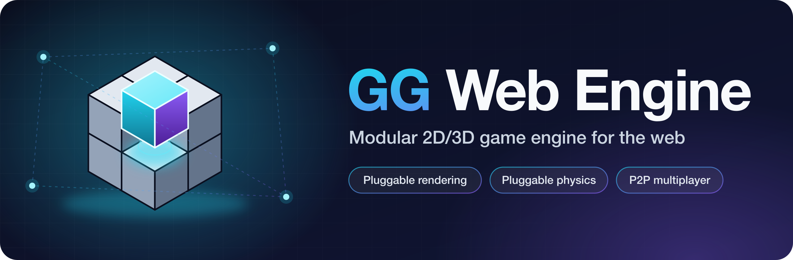
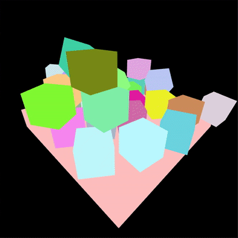
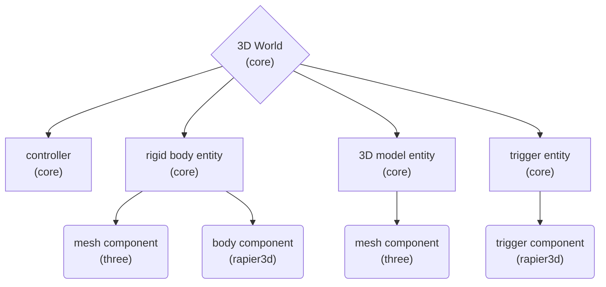

<p align="center">
  
</p>

<p align="center">
  <a href="https://www.npmjs.com/package/@gg-web-engine/core"></a>
  <a href="https://github.com/AndyGura/gg-web-engine/actions/workflows/pull_request_build.yml"></a>
  <a href="LICENSE"></a>
  
</p>

<p align="center">
  <b>Multiplayer physics games in the browser, with no game server.<br/>Cars and character controllers built in. TypeScript end to end.</b>
</p>

<p align="center">
  <a href="https://gg-web-demos.guraklgames.com/"><b>Live demos</b></a> •
  <a href="#-quickstart">Quickstart</a> •
  <a href="#-multiplayer-in-a-dozen-lines">Multiplayer</a> •
  <a href="#-when-to-use-it-and-when-not-to">When to use it</a> •
  <a href="#-packages">Packages</a> •
  <a href="#-architecture">Architecture</a> •
  <a href="https://andygura.github.io/gg-web-engine/">API docs</a> •
  <a href="milestones.md">Roadmap</a>
</p>

---

GG Web Engine is an open-source TypeScript game engine for the browser. Its strongest case is one the
usual browser engines leave to you: **2-8 players share one physics world over WebRTC, peer to peer**, with
ownership, late join, reconnection and replica correction built in - no game server to write or
host ([how](#-multiplayer-in-a-dozen-lines)). It also ships the parts that driving and character
games take longest to get right: a car model with engine, torque curve and gearbox, raycast
vehicles, and first-person, third-person and 2D platformer character controllers.

It does not reinvent rendering or physics. A small, strictly typed core - worlds, entities, clocks,
input, levels, networking - drives battle-tested libraries plugged in behind it:
[Three.js](https://github.com/mrdoob/three.js) or [Pixi.js](https://github.com/pixijs/pixijs) for
rendering, [Rapier](https://github.com/dimforge/rapier.js), [Ammo.js](https://github.com/kripken/ammo.js)
or [Matter.js](https://github.com/liabru/matter-js) for physics. Your game code talks to the core, so
switching to another backend of the same dimension takes one line and needs no gameplay-code
changes. Each backend keeps its own simulation behavior, so expect to retune physics
([what differs](#-faq)). The native objects stay one property away whenever you need them.

## ✨ Highlights

<table>
<tr>
<td width="50%" valign="top">

### 🌐 P2P multiplayer, no game server
Built for 2-8 players sharing one physics world over WebRTC, in 2D or 3D, on any physics adapter.
Ownership, possession, late join, reconnection and replica correction are built in
([how it works](#-multiplayer-in-a-dozen-lines)).

</td>
<td width="50%" valign="top">

### 🎮 Gameplay building blocks
Character controllers (2D and 3D, first/third person), raycast vehicles and a full car model with
engine and gearbox, triggers, grabbable props, cameras, animators, positional audio
([full list](#-architecture)).

</td>
</tr>
<tr>
<td valign="top">

### 🗺️ Data-driven levels
Describe a scene as JSON, register your own entity classes, wire events to behavior with blueprint
graphs, serialize live entities back. Author 3D scenes in Blender with the bundled
[exporter add-on](blender-addon/README.md).

</td>
<td valign="top">

### 🧩 Library-agnostic by design
One visual adapter + one physics adapter of matching dimensionality on top of the core. Switch from
Ammo.js to Rapier by replacing a single constructor: your code keeps compiling and running. Feel and
tuning (friction, restitution, vehicles, character sliding) differ per backend.

</td>
</tr>
<tr>
<td valign="top">

### 🛠️ Developer tooling built in
In-game console with custom commands, physics debug view, stats and per-entity performance
profiling. Import `GgStatic` in a development build to turn it on for every world
([commands](#%EF%B8%8F-developer-console)).

</td>
<td valign="top">

### 🤖 AI-agent ready
Ships a [Claude Code](https://claude.com/claude-code) skill that teaches a coding agent the engine's
mental model, API and common pitfalls, so it guesses less
([install it](#-build-with-an-ai-coding-agent)).

</td>
</tr>
</table>

More of what is in the box:

- **2D and 3D worlds** sharing one set of concepts - `Gg2dWorld` and `Gg3dWorld`.
- **Automatic physics ↔ rendering sync**: an entity binds a display object to a rigid body and keeps them aligned every tick.
- **Hierarchical pausable clocks**, time scale, optional fixed physics timestep, optional auto-pause when the tab is hidden (`pauseWhenHidden`).
- **Screens and loading**: `ScreenManager` runs menu, game and pause screens as a stack of DOM layers; `LoadingScreen.show()`/`hide()` covers startup or a level load with the built-in loading screen, or with your own.
- **Streaming large maps**: `MapGraph3dEntity` loads and disposes map chunks by proximity.
- **Reactive API** on [RxJS](https://github.com/ReactiveX/rxjs): ticks, input, collisions and world events are observables.
- **Strict TypeScript throughout**; annotate the world as `TypedGg3dWorld`/`TypedGg2dWorld` to get the native types of whichever libraries you plugged in ([how](#-faq)).

## 🚀 Quickstart

```bash
npm install @gg-web-engine/core @gg-web-engine/three @gg-web-engine/rapier3d
```

Add a canvas to the page (`<canvas id="gg"></canvas>`, and `body { margin: 0; }`), then:

```typescript
import { Gg3dWorld, Pnt3, Qtrn } from '@gg-web-engine/core';
import { ThreeSceneComponent } from '@gg-web-engine/three';
import { Rapier3dWorldComponent } from '@gg-web-engine/rapier3d';

// one world = clock + visual scene + physics world
const world = new Gg3dWorld({
  visualScene: new ThreeSceneComponent(),
  physicsWorld: new Rapier3dWorldComponent(), // or: new AmmoWorldComponent()
});
await world.init();

// viewport and camera
const renderer = world.addRenderer(
  world.visualScene.factory.createPerspectiveCamera(),
  document.getElementById('gg')! as HTMLCanvasElement,
);
renderer.position = { x: 12, y: 12, z: 12 };
renderer.rotation = Qtrn.lookAt(renderer.camera.position, Pnt3.O);

// static floor
world.addPrimitiveRigidBody({
  shape: { shape: 'BOX', dimensions: { x: 7, y: 7, z: 1 } },
  body: { bodyType: 'static' },
});

// drop a 1 kg cube twice a second
const spawnTimer = world.createClock(true);
spawnTimer.tickRateLimit = 2;
spawnTimer.tick$.subscribe(() => {
  const cube = world.addPrimitiveRigidBody({
    shape: { shape: 'BOX', dimensions: { x: 1, y: 1, z: 1 } },
    body: { mass: 1 },
  });
  cube.position = { x: Math.random() * 5 - 2.5, y: Math.random() * 5 - 2.5, z: 10 };
  setTimeout(() => world.removeEntity(cube, true), 30000);
});

world.start();
```

<p align="center">
  
</p>

> 3D worlds are always Z-up: `{x, y}` is the ground plane, `+Z` points to the sky.

### The same scene as data

Levels can be plain JSON, loaded with the world's `LevelLoader`. Built-in classes cover primitives,
triggers, cameras, players, GLB models, cars, map graphs and sounds; your own classes join through
`world.loader.registerClass(...)`.

```typescript
import { LevelJson } from '@gg-web-engine/core';

const level: LevelJson = {
  entities: [
    {
      class: 'Primitive',
      shape: 'BOX',
      name: 'Floor',
      config: { dimensions: { x: 7, y: 7, z: 1 }, body: { bodyType: 'static' } },
    },
    {
      class: 'Trigger',
      name: 'KillFloor',
      position: { x: 0, y: 0, z: -15 },
      config: { dimensions: { x: 1000, y: 1000, z: 1 } },
      // event wired to a built-in blueprint node, no code needed
      events: { onEntityEntered: { type: 'RemoveEntity', settings: { dispose: true } } },
    },
    { class: 'Camera', name: 'MainCamera', position: { x: 9, y: 12, z: 9 } },
  ],
};

const levelGroup = await world.loader.loadLevel(level, 'MainLevel');
```

## 🌐 Multiplayer in a dozen lines

[`@gg-web-engine/multiplayer`](packages/multiplayer/README.md) turns a single-player world into a
shared one. Peers connect directly to each other over WebRTC data channels; the only backend is a
signaling channel (Firebase Realtime Database on its free plan - or none at all between tabs of one
browser).

```typescript
import {
  FirebaseSignaling,
  getRoomIdFromUrl,
  Network3dController,
  WebRtcMeshTransport,
} from '@gg-web-engine/multiplayer';

const signaling = new FirebaseSignaling();
const roomId = getRoomIdFromUrl() ?? (await signaling.createRoom());

const net = new Network3dController({ transport: new WebRtcMeshTransport({ signaling, roomId }) });
world.addEntity(net);
await net.loadSharedLevel(levelJson, 'level', 'level.json'); // every peer builds the level itself
await net.connect();

const player = await world.loader.createEntity({ class: 'Player', position: spawnPoint });
world.addEntity(player); // spawned at runtime: replicated to every peer automatically
net.possess(player);     // local input drives it; state and input are broadcast
```

The rest of the game stays single-player code. What you get:

- **Every peer simulates everything; ownership decides whose state wins.** Each entity has one owner
  whose state is broadcast, and every other copy is smoothly corrected toward it. A player owns what
  they possess (a character, a car); free objects belong to whoever is near them.
- **Works with what you already have**: rigid bodies, cars and character controllers are networked
  out of the box, in 2D and 3D, on every supported physics library.
- **Late join, reconnection and takeover** of entities whose owner left or hid the tab.
- **Gameplay authority**: `net.hasAuthority(...)` picks the one peer that runs a collision or trigger
  consequence (the owner of the entity involved), so level `events` bindings fire once per room.
- **Zoning** for bigger worlds: peers only connect to and stream state for the grid cells around them.
- **Testable**: an in-process loopback transport with simulated latency, jitter and packet loss, plus
  `net_*` console commands for live inspection.

Try it: open the [Coin run](https://gg-web-demos.guraklgames.com/?example=2d/coin-run)
(2D) or [Fly city](https://gg-web-demos.guraklgames.com/?example=3d/fly-city) (3D) demo
and share the room link.

## 🧭 When to use it, and when not to

A short, honest guide. Every option below is a fine choice for the right game.

**Pick GG Web Engine when**

- Several players should share **one physics world** in the browser (co-op, party, racing, physics
  sandbox) and you don't want to write netcode or run a game server. This is the case it was built
  for.
- The game is a **driving or character game**: a car with an engine and gearbox, raycast vehicles,
  a first/third-person or 2D platformer controller are already there, on every physics backend.
- Levels are **data**: generated, edited by tools or written by an AI agent as JSON, with your own
  entity classes and blueprint-wired events.
- You want to write against an engine API but keep Three.js, Pixi.js, Rapier, Ammo.js or Matter.js
  underneath, with their native objects one property away.

**Pick something else when**

- **Raw Three.js + Rapier (or Pixi.js + Matter.js)**: one scene, full control over the render loop and
  the newest library release on day one. GG pins exact versions of the libraries it wraps and adds a
  layer you may not need for a product viewer or a single physics toy.
- **[Babylon.js](https://www.babylonjs.com/)**: a rendering-heavy 3D game or an XR experience. It has
  a mature PBR pipeline, WebGPU, WebXR, an inspector and node editors, a large community and a long
  record of stable releases. GG has no WebXR support and its 3D rendering is whatever Three.js gives.
- **[Phaser](https://phaser.io/)**: a classic 2D game (tilemaps, sprite animation, arcade physics,
  scenes) with a huge library of tutorials. Choose GG for 2D only if you need shared multiplayer
  physics or one codebase across 2D and 3D.
- **[Godot](https://godotengine.org/) (web export)**: you want a visual editor, or desktop and mobile
  builds from the same project. Expect a large WebAssembly download, and multi-threaded exports need
  cross-origin isolation (COOP/COEP) headers on the host.
- **You need long-term API stability today.** GG is at `0.0.N` with one maintainer; the API can change
  between releases (see [Project status](#-project-status)). Babylon.js, Phaser and Godot have
  versioning policies and large teams behind them.

## 📦 Packages

Every package is published at the same version. Pick the core, one renderer and one physics engine
of the same dimensionality; audio, multiplayer and mobile controls are optional.

| Package | Role | Built on |
|---|---|---|
| [`@gg-web-engine/core`](packages/core/README.md) | Worlds, entities, clocks, input, level loader, dev console | [RxJS](https://github.com/ReactiveX/rxjs) |
| [`@gg-web-engine/three`](packages/three/README.md) | 3D rendering | [Three.js](https://github.com/mrdoob/three.js) |
| [`@gg-web-engine/pixi`](packages/pixi/README.md) | 2D rendering | [Pixi.js](https://github.com/pixijs/pixijs) |
| [`@gg-web-engine/rapier3d`](packages/rapier3d/README.md) | 3D physics | [Rapier](https://github.com/dimforge/rapier.js) |
| [`@gg-web-engine/ammo`](packages/ammo/README.md) | 3D physics | [Ammo.js](https://github.com/kripken/ammo.js) (Bullet) |
| [`@gg-web-engine/rapier2d`](packages/rapier2d/README.md) | 2D physics | [Rapier](https://github.com/dimforge/rapier.js) |
| [`@gg-web-engine/matter`](packages/matter/README.md) | 2D physics | [Matter.js](https://github.com/liabru/matter-js) |
| [`@gg-web-engine/audio`](packages/audio/README.md) | 2D/3D positional audio | [Web Audio API](https://developer.mozilla.org/en-US/docs/Web/API/Web_Audio_API) |
| [`@gg-web-engine/multiplayer`](packages/multiplayer/README.md) | P2P shared-world multiplayer | [WebRTC](https://developer.mozilla.org/en-US/docs/Web/API/WebRTC_API), [Firebase](https://firebase.google.com/docs/database) signaling |
| [`@gg-web-engine/mobile-controls`](packages/mobile-controls/README.md) | On-screen touch controls: sticks, buttons, d-pads, tilt steering | DOM, [Pointer Events](https://developer.mozilla.org/en-US/docs/Web/API/Pointer_events) |

Also in this repo: the [GG Web Engine Exporter](blender-addon/README.md) Blender add-on, which
exports a scene as `.glb` + `.meta` (meshes, rigid bodies, splines, empties) for the 3D loader.

## 🕹️ Demos

**[Browse all interactive demos →](https://gg-web-demos.guraklgames.com/)** Most run on every
physics backend of their dimension (switch it in place; Shooter, Screens, Fly city and Coin run use
one backend only), and each opens in StackBlitz with one click; the source lives under
[`examples/2d`](examples/2d) and [`examples/3d`](examples/3d).

| Demo | Shows |
|---|---|
| [Fly city](https://gg-web-demos.guraklgames.com/?example=3d/fly-city) | Driving through a streamed city: cars, map graph, audio, multiplayer |
| [Coin run](https://gg-web-demos.guraklgames.com/?example=2d/coin-run) | 2D multiplayer platformer rounds |
| [Portal room](https://gg-web-demos.guraklgames.com/?example=3d/portal-room&physics=rapier3d) | First-person character, grabbable props, positional sound |
| [Player character](https://gg-web-demos.guraklgames.com/?example=3d/player-character&physics=rapier3d) | Animated character controllers, in 3D and 2D |
| [Shooter](https://gg-web-demos.guraklgames.com/?example=3d/shooter) | Free-fly camera shooting balls through a textured physics scene |
| [Collision groups pool](https://gg-web-demos.guraklgames.com/?example=3d/collision-groups-pool&physics=rapier3d) | Collision filtering |
| [Primitives](https://gg-web-demos.guraklgames.com/?example=3d/primitives&physics=rapier3d) | A level built from JSON, in 3D and 2D, on every physics backend |

Built with the engine: [The Need For Speed Web](https://tnfsw.guraklgames.com/), a browser remake
of the 1994 classic and the project this engine grew out of.

## 🤖 Build with an AI coding agent

The repo ships a [Claude Code](https://claude.com/claude-code) skill,
[`gg-engine-app-development`](.claude/skills/gg-engine-app-development/SKILL.md), covering the
engine's concepts, bootstrap pattern, available shapes, controllers and loaders, and common
pitfalls. Install it into your own project with [`npx skills`](https://www.skills.sh/):

```bash
npx skills add AndyGura/gg-web-engine --skill gg-engine-app-development -y
```

Then ask your agent to build the scene or game. Add
[`gg-engine-level-json`](.claude/skills/gg-engine-level-json/SKILL.md) the same way if you author
levels as JSON. The remaining skills under [`.claude/skills`](.claude/skills) are for working on the
engine itself - see [`CLAUDE.md`](CLAUDE.md).

## 🌌 Architecture


```mermaid
flowchart TB
  w{"3D World<br/>(core)"} --> cn0["controller<br/>(core)"]
  w --> rb0["rigid body entity<br/>(core)"]
  w --> rb1["3D model entity<br/>(core)"]
  w --> rb2["trigger entity<br/>(core)"]
  rb0 --> c0("mesh component<br/>(three)")
  rb0 --> c1("body component<br/>(rapier3d)")
  rb1 --> c2("mesh component<br/>(three)")
  rb2 --> c3("trigger component<br/>(rapier3d)")
```

Three concepts carry the whole engine:

- **[World](https://andygura.github.io/gg-web-engine/modules/core/base/gg-world.ts/)** -
  [`Gg2dWorld`](https://andygura.github.io/gg-web-engine/modules/core/2d/gg-2d-world.ts/) or
  [`Gg3dWorld`](https://andygura.github.io/gg-web-engine/modules/core/3d/gg-3d-world.ts/). Owns the
  clock, the visual scene, the physics world, keyboard input and the list of spawned entities, and
  propagates ticks to them in order. A page can run several worlds at once.
- **[Entity](https://andygura.github.io/gg-web-engine/modules/core/base/entities/i-entity.ts/)** -
  anything that lives in a world and can react to ticks: a rigid body, a trigger, a renderer, a
  controller. Entities are implemented in the core and know nothing about the libraries underneath.
- **[Component](https://andygura.github.io/gg-web-engine/modules/core/base/components/i-component.ts/#icomponent-interface)** -
  the part an adapter package implements: a mesh, a sprite, a rigid body, a camera, a physics world.
  An entity uses zero or more components.

Supporting pieces:

- **Clocks** form a hierarchy rooted at the `requestAnimationFrame`-driven
  [`GgGlobalClock`](https://andygura.github.io/gg-web-engine/modules/core/base/clock/global-clock.ts/).
  Each world has a [`PausableClock`](https://andygura.github.io/gg-web-engine/modules/core/base/clock/pausable-clock.ts/);
  pausing a clock pauses its children, so in-game timers stop with the world.
- **[Inputs](https://andygura.github.io/gg-web-engine/modules/core/base/inputs/input.ts/)** -
  `KeyboardInput` (key bindings as `Observable<boolean>`), `MouseInput` (deltas, pointer lock) and
  `DirectionInput` (WASD/arrows) - are created and consumed by controller entities.
- **Factories** ([2D](https://andygura.github.io/gg-web-engine/modules/core/2d/factories.ts/),
  [3D](https://andygura.github.io/gg-web-engine/modules/core/3d/factories.ts/)) create primitive
  display objects and rigid bodies from a shape descriptor.
- **Loaders**: `LevelLoader` builds entities from level JSON; the 3D GLB loader reads `.glb` + `.meta`
  scenes exported from Blender.

<details>
<summary><b>Built-in entities</b></summary>

- **[Entity2d](https://andygura.github.io/gg-web-engine/modules/core/2d/entities/entity-2d.ts/#entity2d-class)** / **[Entity3d](https://andygura.github.io/gg-web-engine/modules/core/3d/entities/entity-3d.ts/#entity3d-class)** - a display object (sprite or mesh) plus a rigid body, kept in sync every tick
- **[Trigger2dEntity](https://andygura.github.io/gg-web-engine/modules/core/2d/entities/trigger-2d.entity.ts/#trigger2dentity-class)** / **[Trigger3dEntity](https://andygura.github.io/gg-web-engine/modules/core/3d/entities/trigger-3d.entity.ts/#trigger3dentity-class)** - a physics volume that emits events when another entity enters or leaves it
- **[CharacterController2dEntity](https://andygura.github.io/gg-web-engine/modules/core/2d/entities/character-controller-2d.entity.ts/#charactercontroller2dentity-class)** / **[CharacterController3dEntity](https://andygura.github.io/gg-web-engine/modules/core/3d/entities/character-controller-3d.entity.ts/#charactercontroller3dentity-class)** - a capsule-bodied, physics-driven character: walk, run, jump, gravity, plus crouch in 3D
- **[PlayerCharacterController2d](https://andygura.github.io/gg-web-engine/modules/core/2d/entities/controllers/input/player-character-2d.controller.ts/#playercharactercontroller2d-class)** / **[PlayerCharacterController](https://andygura.github.io/gg-web-engine/modules/core/3d/entities/controllers/input/player-character.controller.ts/#playercharactercontroller-class)** - keyboard/mouse control and a following camera for a character; first- and third-person modes with camera-collision avoidance in 3D
- **[RaycastVehicle3dEntity](https://andygura.github.io/gg-web-engine/modules/core/3d/entities/raycast-vehicle-3d.entity.ts/#raycastvehicle3dentity-class)** - a raycast vehicle with chassis and wheel meshes bound to it
- **[GgCarEntity](https://andygura.github.io/gg-web-engine/modules/core/3d/entities/gg-car/gg-car.entity.ts/#ggCarentity-class)** - a four-wheel car simulating an engine with a torque table, a gearbox and more, with **[CarHandlingController](https://andygura.github.io/gg-web-engine/modules/core/3d/entities/controllers/input/car-handling.controller.ts/#carkeyboardhandlingcontroller-class)** to drive it
- **[Grabbable3dEntity](https://andygura.github.io/gg-web-engine/modules/core/3d/entities/grabbable-3d.entity.ts/#grabbable3dentity-class)** - a prop that can be picked up, carried and thrown, paired with **[ObjectGrabController](https://andygura.github.io/gg-web-engine/modules/core/3d/entities/controllers/input/object-grab.controller.ts/#objectgrabcontroller-class)**
- **[MapGraph3dEntity](https://andygura.github.io/gg-web-engine/modules/core/3d/entities/map-graph-3d.entity.ts/#mapgraph3dentity-class)** - loads the nearby parts of a big map and disposes the far ones
- **[ParticleSystem3dEntity](https://andygura.github.io/gg-web-engine/modules/core/3d/entities/particle-system-3d.entity.ts/#particlesystem3dentity-class)** - camera-facing sprite particles (smoke, dust, fire) simulated in core, emitted by the app or at a rate, optionally attached to another entity, with a fixed step for old-school effects
- **[SurfaceFollowingEntity](https://andygura.github.io/gg-web-engine/modules/core/3d/entities/surface-following.entity.ts/#surfacefollowingentity-class)** - a smooth surface collider declared parametrically
- **[Renderer](https://andygura.github.io/gg-web-engine/modules/core/base/entities/i-renderer.entity.ts/#irendererentity-class)** - renders the scene and manages canvas size (fullscreen by default)
- **[FreeCameraController](https://andygura.github.io/gg-web-engine/modules/core/3d/entities/controllers/input/free-camera.controller.ts/#freecameracontroller-class)** - fly a camera with WASD + mouse
- **[AnimationMixer](https://andygura.github.io/gg-web-engine/modules/core/base/entities/controllers/animation-mixer.ts/#animationmixer-class)** - smooth transitions between animation functions, with **[Entity2dPositioningAnimator](https://andygura.github.io/gg-web-engine/modules/core/2d/entities/controllers/entity-2d-positioning.animator.ts/#entity2dpositioninganimator-class)** / **[Entity3dPositioningAnimator](https://andygura.github.io/gg-web-engine/modules/core/3d/entities/controllers/animators/entity-3d-positioning.animator.ts/#entity3dpositioninganimator-class)** for entities and **[Camera3dAnimator](https://andygura.github.io/gg-web-engine/modules/core/3d/entities/controllers/animators/camera-3d.animator.ts/#camera3danimator-class)** for cameras
- **[InlineTickController](https://andygura.github.io/gg-web-engine/modules/core/base/entities/controllers/inline-controller.ts/#createinlinetickcontroller)** - a tick callback added to the world in one line

</details>

<details>
<summary><b>Components an adapter implements</b></summary>

- **[IVisualScene2dComponent](https://andygura.github.io/gg-web-engine/modules/core/2d/components/rendering/i-visual-scene-2d.component.ts/#ivisualscene2dcomponent-interface) / [IVisualScene3dComponent](https://andygura.github.io/gg-web-engine/modules/core/3d/components/rendering/i-visual-scene-3d.component.ts/#ivisualscene3dcomponent-interface)** - the visual scene or display object container
- **[IDisplayObject2dComponent](https://andygura.github.io/gg-web-engine/modules/core/2d/components/rendering/i-display-object-2d.component.ts/#idisplayobject2dcomponent-interface) / [IDisplayObject3dComponent](https://andygura.github.io/gg-web-engine/modules/core/3d/components/rendering/i-display-object-3d.component.ts/#idisplayobject3dcomponent-interface)** - a sprite or mesh
- **[IRenderer2dComponent](https://andygura.github.io/gg-web-engine/modules/core/2d/components/rendering/i-renderer-2d.component.ts/#irenderer2dcomponent-class) / [IRenderer3dComponent](https://andygura.github.io/gg-web-engine/modules/core/3d/components/rendering/i-renderer-3d.component.ts/#irenderer3dcomponent-class)** - the renderer
- **[IPhysicsWorld2dComponent](https://andygura.github.io/gg-web-engine/modules/core/2d/components/physics/i-physics-world-2d.component.ts/#iphysicsworld2dcomponent-interface) / [IPhysicsWorld3dComponent](https://andygura.github.io/gg-web-engine/modules/core/3d/components/physics/i-physics-world-3d.component.ts/#iphysicsworld3dcomponent-interface)** - the physics world
- **[IRigidBody2dComponent](https://andygura.github.io/gg-web-engine/modules/core/2d/components/physics/i-rigid-body-2d.component.ts/#irigidbody2dcomponent-interface) / [IRigidBody3dComponent](https://andygura.github.io/gg-web-engine/modules/core/3d/components/physics/i-rigid-body-3d.component.ts/#irigidbody3dcomponent-interface)** - a rigid body
- **[ITrigger2dComponent](https://andygura.github.io/gg-web-engine/modules/core/2d/components/physics/i-trigger-2d.component.ts/#itrigger2dcomponent-interface) / [ITrigger3dComponent](https://andygura.github.io/gg-web-engine/modules/core/3d/components/physics/i-trigger-3d.component.ts/#itrigger3dcomponent-interface)** - a physics object that only detects overlaps
- **[IParticleSystem3dComponent](https://andygura.github.io/gg-web-engine/modules/core/3d/components/rendering/i-particle-system-3d.component.ts/#iparticlesystem3dcomponent-interface)** - draws a particle system's sprites (3D)
- **[ICameraComponent](https://andygura.github.io/gg-web-engine/modules/core/3d/components/rendering/i-camera.component.ts/#icameracomponent-interface)** - a camera (3D)
- **[IRaycastVehicleComponent](https://andygura.github.io/gg-web-engine/modules/core/3d/components/physics/i-raycast-vehicle.component.ts/#iraycastvehiclecomponent-interface)** - a raycast vehicle (3D)

</details>

## 🖥️ Developer console

Enable it with `GgStatic.instance.devConsoleEnabled = true` and press <kbd>`</kbd> at runtime.
Register your own commands with `GgStatic.instance.registerConsoleCommand`.

<details>
<summary><b>Built-in commands</b></summary>

#### Global
| Command       | Arguments           | Description |
|---------------|---------------------|-------------|
| `commands`    | -                   | Print all available commands: global ones and those of the currently selected world |
| `help`        | `string`            | Print the doc string of a command |
| `worlds`      | -                   | Print all currently available worlds, with the rendering/physics/audio backend each one runs on |
| `world`       | `string?`           | Select a world by name (optional), then print the selected one: name, backends, clock state, time scale, fps limit, physics step, entity and renderer counts |
| `stats_panel` | `0\|1?`             | Turn the stats panel on/off; skip the argument to toggle |
| `debug_panel` | `0\|1?`             | Turn the debug panel on/off; skip the argument to toggle |
| `bind_key`    | `string, ...string` | Bind a keyboard key (by [code](https://www.toptal.com/developers/keycode)) to a console command |
| `unbind_key`  | `string`            | Unbind a keyboard key from a console command |

#### Any world
| Command       | Arguments          | Description |
|---------------|--------------------|-------------|
| `timescale`   | `float?`           | Get or set the time scale of the world clock. Default is 1.0 |
| `fps_limit`   | `int?`             | Get or set the tick rate limit of the world clock. 0 means no limit |
| `renderers`   | -                  | Print all renderers in the world |
| `debug_view`  | `0\|1?, string?`   | Turn the physics debug view on/off; skip the first argument to toggle. The second argument is a renderer name (first renderer by default) |
| `performance` | `int?, avg\|peak?` | Measure time spent per entity. Arguments: number of samples (20 by default) and `avg` (sort by average time) or `peak` (record the highest value per entity) |

#### 2D world
| Command        | Arguments        | Description |
|----------------|------------------|-------------|
| `gravity`      | `?float, ?float` | Get or set the gravity vector. One argument sets `{x: 0, y: value}`, two set the whole vector. Default is `0 9.82` |
| `player_spawn` | `float, float`   | Spawn a default player character (capsule body, left/right/jump/run keys) at the given coordinates, controlling the first renderer's camera |

#### 3D world
| Command        | Arguments                            | Description |
|----------------|--------------------------------------|-------------|
| `gravity`      | `?float, ?float, ?float`             | Get or set the gravity vector. One argument sets `{x: 0, y: 0, z: -value}`, three set the whole vector. Default is `0 0 -9.82` |
| `player_spawn` | `float, float, float`                | Spawn a default player character (capsule body, WASD/arrows movement, mouse-look) at the given coordinates, controlling the first renderer's camera |
| `player_mode`  | `string, first-person\|third-person` | Switch a named `PlayerCharacterController` (as returned by `player_spawn`) between first- and third-person view |

The multiplayer package adds `net_status`, `net_owners`, `net_tuning` and `net_lag`.

</details>

## ❓ FAQ

<details>
<summary><b>Do all physics backends behave the same?</b></summary>

No. Every backend of one dimension honors the same API contract: the same calls succeed, the same
events fire, units match, and 3D is Z-up everywhere. The simulation underneath is the library's own,
so switching backends keeps your code running but changes how things move. Expect to retune masses,
friction, vehicles and character settings after a switch. Known differences:

**3D: Rapier vs Ammo.js**

- **Character controller.** Rapier's own kinematic character controller does the stepping, ground
  snapping and pushing of dynamic bodies. On Ammo the adapter sweeps the capsule itself, with its own
  step-up, slope-sliding and push logic. Ledges, steep slopes and walking into props feel different.
- **Raycast vehicles.** Rapier's vehicle controller is a port of Bullet's, but suspension, tyre
  friction and braking still differ, so the same wheel options drive differently. `rollInfluence`
  only exists on Ammo and `sideFrictionStiffness` only on Rapier. Tune a `GgCarEntity` or raycast
  vehicle on the backend you ship.
- **Continuous collision detection.** Rapier sweeps the body's real shape; Ammo sweeps an
  approximating sphere, so fast bodies hitting thin geometry behave differently.
- **Kinematic bodies.** Rapier has native position- and velocity-driven kinematic bodies. Ammo has one
  kinematic flag; the adapter emulates `kinematic_vel` by moving the body once per tick.
- **Sleeping.** Both put resting bodies to sleep automatically, with their own thresholds and timing.

**2D: Rapier vs Matter.js**

- **No CCD in Matter.** `ccd: true` logs a warning and has no effect; fast bodies can tunnel through
  thin walls.
- **No kinematic bodies in Matter.** `kinematic_pos`/`kinematic_vel` log a warning and fall back to
  static bodies, which don't push or carry what rests on them when moved.
- **Sleeping.** Matter bodies never fall asleep on their own (`sleep()`/`wakeUp()` still work), and
  setting the position or velocity of a sleeping Matter body does not wake it. Rapier sleeps resting
  bodies automatically and wakes a body you move.
- **Character controller.** Rapier's native controller vs, on Matter, one built from overlap queries
  over short substeps.
- **Settling.** Matter's solver is not substepped: round bodies on a slope under weak gravity can roll
  for a long time before they come to rest.

Rapier supports every `BodyOptions` feature natively in both dimensions. Demos that offer a single
backend in the [gallery](https://gg-web-demos.guraklgames.com/) have only been built and tuned on it.

</details>

<details>
<summary><b>How do I reach the native Three.js / Pixi / physics objects?</b></summary>

Every component keeps a reference to the native object it wraps:

- `nativeScene` - 3D visual scene
- `nativeContainer` - 2D visual container
- `nativeMesh` - 3D display object
- `nativeSprite` - 2D display object
- `nativeWorld` - 2D/3D physics world
- `nativeBody` - 2D/3D physics body

For instance, `ThreeSceneComponent` has a public field `nativeScene: THREE.Scene`.

</details>

<details>
<summary><b>TypeScript does not know the native types of my world. How do I fix that?</b></summary>

The engine is strictly typed and works abstractly over whichever adapters are plugged in, so
TypeScript cannot always infer adapter-specific types from the constructor alone:

```typescript
const world = new Gg3dWorld({
  visualScene: new ThreeSceneComponent(),
  physicsWorld: new AmmoWorldComponent(),
});
const box = world.addPrimitiveRigidBody(...);
box.object3D.scale = { x: 2, y: 2, z: 2 };          // ok
box.object3D.nativeMesh.material = myThreeMaterial; // TypeScript error
```

Annotate the world explicitly:

```typescript
const world: TypedGg3dWorld<ThreeGgWorld, AmmoGgWorld> = new Gg3dWorld({
  visualScene: new ThreeSceneComponent(),
  physicsWorld: new AmmoWorldComponent(),
});
const box = world.addPrimitiveRigidBody(...);
box.object3D.nativeMesh.material = myThreeMaterial; // works
box.objectBody.nativeBody.applyTorque(...);         // works too
```

Every adapter exports a `[ModuleName]GgWorld` type. `const world: ThreeGgWorld = new Gg3dWorld(...)`
types the visual side for Three.js and leaves physics abstract; `TypedGg3dWorld<Visual, Physics>`
welds a visual and a physics world type together (`TypedGg2dWorld` does the same in 2D).

The audio world type is an optional third parameter, in that order - visual, physics, audio. Leave
it out and `world.audioScene` is typed as the abstract audio scene; pass it to get the native types
of the audio adapter as well:

```typescript
import { WebAudioGgWorld3D, WebAudioScene3dComponent } from '@gg-web-engine/audio';

const world: TypedGg3dWorld<ThreeGgWorld, AmmoGgWorld, WebAudioGgWorld3D> = new Gg3dWorld({
  visualScene: new ThreeSceneComponent(),
  physicsWorld: new AmmoWorldComponent(),
  audioScene: new WebAudioScene3dComponent(),
});
```

</details>

<details>
<summary><b>Can I use it with React, Angular, Vue or Svelte?</b></summary>

Yes - the engine only needs a `<canvas>`. Create the world in a lifecycle hook once the canvas
exists (`useEffect`, `ngOnInit`, `onMounted`), and call `world.dispose()` on teardown.

</details>

<details>
<summary><b>Why is the viewport off-center or blurry on mobile/retina displays?</b></summary>

Add this meta tag to your `<head>`:

```html
<meta name="viewport" content="width=device-width, user-scalable=no, minimum-scale=1, maximum-scale=1">
```

</details>

## 🚧 Project status

The engine is **experimental**: versions are `0.0.N` and the public API can change between any two
releases. It began as the foundation of [The Need For Speed Web](https://tnfsw.guraklgames.com/),
where the physics backend was swapped more than once - which is where the library-agnostic
architecture comes from.

- [`CHANGELOG.md`](CHANGELOG.md) - what changed in each release
- [`milestones.md`](milestones.md) - the public roadmap and known gaps

## 🤝 Contributing

Bug reports, feature requests and pull requests are welcome.

- Open an [issue](https://github.com/AndyGura/gg-web-engine/issues) for a bug or an idea.
- Read [`CONTRIBUTING.md`](CONTRIBUTING.md) for the build, test and release process.

Local setup in short - `packages/*` is an npm workspace, so one install links every adapter to the
local core:

```bash
npm install           # link the packages/* workspace
npm run build         # full build of every package
npm run build:watch   # rebuild core + adapters on every save
```

To see your changes live in an example app:

```bash
bash etc/switch_example_to_local_gg.sh examples/3d/<example-dir>
cd examples/3d/<example-dir> && npm start
```

Undo the link with `bash etc/restore_example_from_local_gg.sh examples/3d/<example-dir>` before
committing.

If the engine is useful to you, a ⭐ on the repo helps others find it.

<a href="https://www.buymeacoffee.com/andygura"></a>

## 📜 License

[Apache License 2.0](LICENSE)
