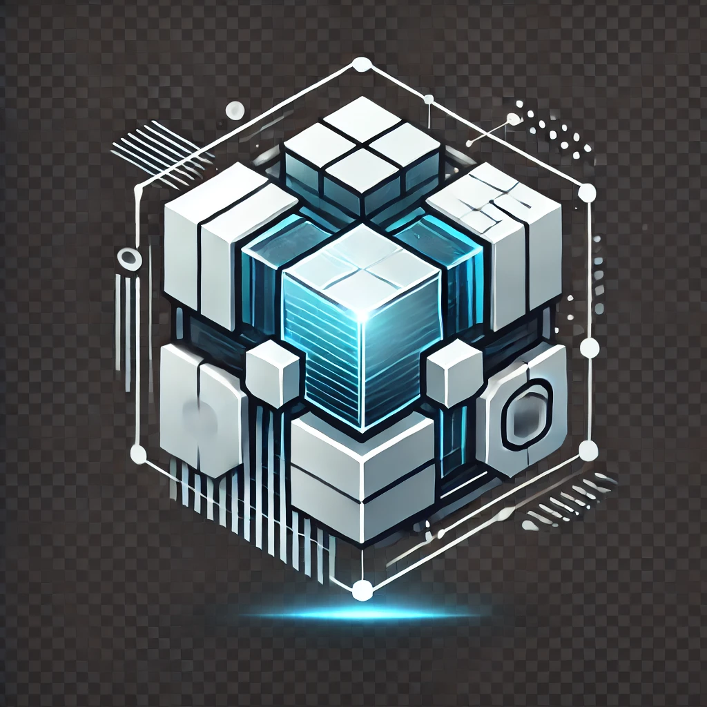

<p align="center">
  
</p>
<h2 align="center">An attempt to create open source abstract game engine for browser</h2>

<p align="center">
  <a href="#about">About</a> •
  <a href="#vision">Vision</a> •
  <a href="#status">Status</a> •
  <a href="#features">Features</a> •
  <a href="#integrations">Integrations</a> •
  <a href="#quickstart">Quickstart</a> •
  <a href="#examples">Examples</a> •
  <a href="#architecture">Architecture</a> •
  <a href="#support">Support</a> •
  <a href="#license">License</a>
</p>

---

## About
This project strives to be an open-source framework, providing ready-to-use tool set for making web applications, 
related to 2D/3D graphics and physics simulation (mostly games), quickly and easily. There are plenty of cool libraries 
for in-browser games, such as [three.js](https://github.com/mrdoob/three.js) for rendering using WebGL, 
[ammo.js](https://github.com/kripken/ammo.js) for WebAssembly physics and many more: **gg-web-engine** is not going to 
compete with any of them and re-invent the bicycle, but rather work on top of such libraries: the developer, using 
**gg-web-engine**, will have full control on those libraries, besides the built-in **gg-web-engine** functionality. 
The core of the engine **DO NOT** rely on any specific library and the end product can be quickly switched from one 
stack of physics/rendering libraries to anothers or even have self-implemented own solutions by implementing simple 
bindings to **gg-web-engine** core.

## Vision
- The project is not going to provide low-level solutions for rendering, physics, sounds etc. but have the integration 
with other libraries for that
- The project is going to work with both 2D and 3D worlds
- The project provides ready-to-use common functionality: canvas, game world, rendering loop, physics ticks, key/mouse 
controls and many more down the road
- The project provides common entities: rigid primitive, cameras, raycast vehicle and many more down the road
- The project provides own way of serialization objects: has a built-in blender exporter which will export geometry
  and rigid body properties to files, seamlessly supported by the engine (**3D world only** for now)
- The project does not restrict developer from working with integrated libraries directly
- The project is written on [TypeScript](https://github.com/microsoft/TypeScript)
- The project is module-based ES6 code
- The project intensively uses [rxjs](https://github.com/ReactiveX/rxjs)

## Status
Pre-pre-alpha super-experimental release. I'll be happy to see any feature requests and bug reports in the 
[Issues](https://github.com/AndyGura/gg-web-engine/issues) and [Pull Requests](https://github.com/AndyGura/gg-web-engine/pulls) 
are more than welcome. This project is initialized with parts of my own attempt to implement replica of old NFS game
[The Need For Speed Web](https://tnfsw.guraklgames.com/) (far from final version), by the way it was using cannon.js 
and then migrated to ammo.js with minimum changes to the architecture, which in fact inspired me to start this project: 
there was a lot to learn and realize that game development for browsers deserves more than available. Right now the 
engine is still focused on that NFS project and all the functionality is written specifically for it, so one can notice 
that there is currently lack of functionality which is not related to racing games.

## Features
- Automatically working physics/rendering ticks
- Automatic physics body/visual mesh position/rotation binding
- Controllers interface, allowing to add some functions as part of tick
- rigid bodies
- trigger zones
- free-fly camera controller (3D world only)
- raycast car entity (3D world only) and dedicated keyboard controller for it
- map graph, allowing to load only nearest part of map, using graph of map areas (3D world only)
- UI dev console (enable console for world in your code and press ` at runtime)
- physics debugger renderer (3D world only)

## Integrations
Note: at this early step, the project does not give much flexibility in that regard, will be changed in future
- [**@gg-web-engine/three**](https://github.com/AndyGura/gg-web-engine/tree/main/packages/three/README.md) - 3D world rendering module [Three.js](https://github.com/mrdoob/three.js)
- [**@gg-web-engine/ammo**](https://github.com/AndyGura/gg-web-engine/tree/main/packages/ammo/README.md) - 3D world physics simulation module [Ammo.js](https://github.com/kripken/ammo.js)
- [**@gg-web-engine/pixi**](https://github.com/AndyGura/gg-web-engine/tree/main/packages/pixi/README.md) - 2D world rendering module [Pixi.js](https://github.com/pixijs/pixijs)
- [**@gg-web-engine/matter**](https://github.com/AndyGura/gg-web-engine/tree/main/packages/matter/README.md) - 2D world physics simulation module [Matter.js](https://github.com/liabru/matter-js)

## Quickstart
**Note: right now it does not provide CommonJS/UMD modules**
### Installation:
`npm install --save @gg-web-engine/core`<br/>
And install integration modules, for instance if I want to create 3D world:<br/>
`npm install --save @gg-web-engine/three`<br/>
`npm install --save @gg-web-engine/ammo`

Add to your `tsconfig.json` in the record `compilerOptions.paths` (example for ammo-js):
```json lines
"mini-signals": ["./node_modules/mini-signals/index.js"]
```
Add to your `package.json` (fix for ammo-js dependencies):
```json lines
"browser": {
  "fs": false,
  "os": false,
  "path": false
}
```
You can check all required additional configurations per integration in their own README, check the <a href="#integrations">integrations list</a>

### Usage:
1) add somewhere in dom tree: ```<div id="gg-stage"></div>```
1) remove default margin from page via CSS: ```body { margin: 0; }```
1) write bootstrap script, example:
```typescript
import { interval } from 'rxjs';
import { Gg3dEntity, Gg3dWorld, GgViewportManager, Qtrn } from '@gg-web-engine/core';
import { Gg3dVisualScene, GgRenderer } from '@gg-web-engine/three';
import { Gg3dPhysicsWorld } from '@gg-web-engine/ammo';

// create world
const world: Gg3dWorld = new Gg3dWorld(new Gg3dVisualScene(), new Gg3dPhysicsWorld());
await world.init();

// create viewport and renderer
const canvas = await GgViewportManager.instance.createCanvas(1);
const renderer: GgRenderer = new GgRenderer(canvas);
renderer.camera.position = { x: 15, y: 15, z: 9 };
renderer.camera.rotation = Qtrn.lookAt(renderer.camera.position, {x: 0, y: 0, z: 0}, {x: 0, y: 0, z: 1});
world.addEntity(renderer);

// create floor (static rigid body)
world.addPrimitiveRigidBody({
  shape: { shape: 'BOX', dimensions: { x: 7, y: 7, z: 1 } },
  body: { dynamic: false },
});

// spawn cubes with mass 1kg twice a second
interval(500).subscribe(() => {
  // generate cube
  let item: Gg3dEntity = world.addPrimitiveRigidBody({
    shape: { shape: 'BOX', dimensions: { x: 1, y: 1, z: 1 } },
    body: { mass: 1 },
  });
  // set position to cube
  item.position = { x: Math.random() * 5 - 2.5, y: Math.random() * 5 - 2.5, z: 10 };
  // delete cube from world after 30 seconds
  setTimeout(() => { world.removeEntity(item, true); }, 30000);
});

// start simulation
world.start();
```
And run it:
<p align="center">
  
</p>

## Examples
- #### [Angular three+ammo](https://stackblitz.com/edit/angular-kuunqq?file=src%2Fmain.ts)
- #### [Angular pixi+matter](https://stackblitz.com/edit/angular-v67tt6?file=src%2Fmain.ts)
- #### Entity Loader. [Source code](https://github.com/AndyGura/gg-web-engine/blob/main/examples/model-loader/src/app/app.component.ts)
- #### Fly city. [Live demo](https://gg-web-demos.guraklgames.com/index.html), [Source code](https://github.com/AndyGura/gg-web-engine/blob/main/examples/fly-city/src/app/app.component.ts)

## Architecture
Technical documentation available at [GitHub Pages](https://andygura.github.io/gg-web-engine/)
### Clock
Clock is an entity, responsible for tracking time and firing ticks. It measures time and on each tick emits two numbers:
`elapsedTime` and `delta`, where `delta` always equals to difference between current elapsed time, and elapsed time,
fired on the previous tick. All clock instances have hierarchy: pausing clock will automatically pause all of its child
clocks, which is nice to use for in-game timers: all timers will be paused when world clock is paused. There are two
built-in implementations of clock:
#### [GgGlobalClock](https://andygura.github.io/gg-web-engine/modules/core/base/clock/global-clock.ts/)
Singleton, starts emitting ticks as soon as accessed. For scheduling ticks, it uses `animationFrameScheduler` from rxjs,
which uses `requestAnimationFrame` API. The elapsed time for each tick is a timestamp, e.g. total amount of
milliseconds, passed from 01.01.1970 00:00:00.000 UTC. The instance of this clock is always the root clock in clocks hierarchy
#### [PausableClock](https://andygura.github.io/gg-web-engine/modules/core/base/clock/pausable-clock.ts/)
The class for all remaining clocks: it measures time elapsed when was started. Has the ability to be paused/resumed,
and elapsed time will not be affected by pause: it will proceed from the same state it was paused. Every world has its
own instance of PausableClock, where parent clock is **GgGlobalClock**
#### Example of clocks hierarchy


### [World](https://andygura.github.io/gg-web-engine/modules/core/base/gg-world.ts/)
World is a container of all entities of your game, manages the entire flow. Though it is possible to have multiple 
worlds in one page, in most cases you only need one. World consists of:
- clock
- visual scene, e.g. "sub-world", containing everything related to rendering. This is an interface, which has to be 
implemented by integration library
- physics world, e.g. "sub-world", containing everything related to physics simulation. This is an interface, which has to be
  implemented by integration library
- list of all spawned world entities, sorted by tick order, and API for spawning/removing them
- logic to propagate clock ticks to every spawned active entity
- keyboard input

There are two built-in variants of world implementation: **[Gg2dWorld](https://andygura.github.io/gg-web-engine/modules/core/2d/gg-2d-world.ts/)** and **[Gg3dWorld](https://andygura.github.io/gg-web-engine/modules/core/3d/gg-3d-world.ts/)**

### [Entity](https://andygura.github.io/gg-web-engine/modules/core/base/entities/gg-entity.ts/)
Basically, everything that listens ticks and can be added/removed from world. Built-in entities:
- **[Gg2dEntity](https://andygura.github.io/gg-web-engine/modules/core/2d/entities/gg-2d-entity.ts/)**/**[Gg3dEntity](https://andygura.github.io/gg-web-engine/modules/core/3d/entities/gg-3d-entity.ts/)** encapsulates display object (sprite or mesh respectively) and physics body. 
Synchronizes position/rotation each tick
- **[Gg2dTriggerEntity](https://andygura.github.io/gg-web-engine/modules/core/2d/entities/gg-2d-trigger.entity.ts/)**/**[Gg3dTriggerEntity](https://andygura.github.io/gg-web-engine/modules/core/3d/entities/gg-3d-trigger.entity.ts/)** has only physics body, but instead of participating in collisions, emits
events when some another positionable entity entered/left its area
- **[InlineTickController](https://andygura.github.io/gg-web-engine/modules/core/base/entities/inline-controller.ts/)** simple controller, which can be created and added to world using one line of code
- **[Renderer](https://andygura.github.io/gg-web-engine/modules/core/base/entities/base-gg-renderer.ts/)** controller, which renders the scene
- **[AnimationMixer](https://andygura.github.io/gg-web-engine/modules/core/base/entities/controllers/animation-mixer.ts/)** controller, which mixes animations: use-case is if you have some animation function, and you need a 
smooth transition to another animation function
- **[Entity2dPositioningAnimator](https://andygura.github.io/gg-web-engine/modules/core/2d/entities/controllers/entity-2d-positioning.animator.ts/)**/**[Entity3dPositioningAnimator](https://andygura.github.io/gg-web-engine/modules/core/3d/entities/controllers/animators/entity-3d-positioning.animator.ts/)** controllers extending **AnimationMixer**, which apply 
position/rotation to positionable entity
- **[Camera3dAnimator](https://andygura.github.io/gg-web-engine/modules/core/3d/entities/controllers/animators/camera-3d.animator.ts/)** dedicated **AnimationMixer** for perspective camera: translates camera, target, up, fov etc.
- **[FreeCameraController](https://andygura.github.io/gg-web-engine/modules/core/3d/entities/controllers/input/free-camera.controller.ts/)** a controller, allows to control camera with WASD + mouse
- **[CarKeyboardHandlingController](https://andygura.github.io/gg-web-engine/modules/core/3d/entities/controllers/input/car-keyboard-handling.controller.ts/)** a controller allowing to control car with keyboard
- **[Gg3dMapGraphEntity](https://andygura.github.io/gg-web-engine/modules/core/3d/entities/gg-3d-map-graph.entity.ts/)** an entity, which loads parts of big map and disposes loaded map chunks, which are far away
- **[Gg3dRaycastVehicleEntity](https://andygura.github.io/gg-web-engine/modules/core/3d/entities/gg-3d-raycast-vehicle.entity.ts/)** a car

### [Input](https://andygura.github.io/gg-web-engine/modules/core/base/inputs/input.ts/)
Input is a class, responsible for handling external actions, such as mouse move, key presses, gamepad interactions etc.
When implementing multiplayer, it probably will be the best place to handle incoming data for reflecting it on the world
state. Input does not depend on ticks and is not a part of the world, it should be created and used by some controller
entity, added to the world. All inputs extend abstract class Input<TStartParams, TStartParams>. Engine provides those
inputs out-of-box:
#### [KeyboardInput](https://andygura.github.io/gg-web-engine/modules/core/base/inputs/keyboard.input.ts/)
This input handles key presses, allows to setup key bindings: provides Observable<boolean>, which emits true on key down
and false on key up. When binding many keys to the same functionality, will emit true when any of bound keys pressed,
and false only when all bound keys released. Every world has its own instance of keyboard controller
#### [MouseInput](https://andygura.github.io/gg-web-engine/modules/core/base/inputs/mouse.input.ts/)
This input handles mouse movements and provides an Observable, which emits how much mouse position changed after last
event. Supports pointer lock functionality
#### [DirectionKeyboardInput](https://andygura.github.io/gg-web-engine/modules/core/base/inputs/direction.keyboard-input.ts/)
A shortcut for implementing direction key bindings: WASD, arrows, or both at once. Provides observable with direction
#### Example of input usage


### Factory
There is simple factory, allowing to easily create rigid bodies. See 
[2D](https://andygura.github.io/gg-web-engine/modules/core/2d/factories.ts/) and 
[3D](https://andygura.github.io/gg-web-engine/modules/core/3d/factories.ts/) factories

### Loader
Currently, there is only one loader available, and only for 3D world. It uses own format of serializing blender scene: 
**.glb**+**.meta** files, where glb is a binary GLTF file, containing mesh+materials, and meta is a json file, 
containing evverything from blend file, not included in glb, such as empty objects; rigid bodies; splines. Right now it 
is on very early stage. The script to make glb+meta from blender file is here: 
[build_blender_scene.py](packages/core/blender_exporter/build_blender_scene.py)

### Console
Engine provides a simple console, which can be used at runtime (if enabled in world) by pressing \`. Your game can 
provide custom console commands using `world.registerConsoleCommand` function

## Support
You can support project by:
- giving any feedback, bug report, feature request to [Issues](https://github.com/AndyGura/gg-web-engine/issues) 
- fork & submit a [Pull Request](https://github.com/AndyGura/gg-web-engine/pulls)
- [](https://www.buymeacoffee.com/andygura)

## License
[Apache License](LICENSE)
